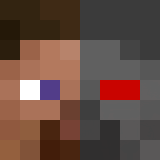

<h1 align="center" style="font-weight: normal;"><b>SecondBrain</b></h1>

A Fabric mod that brings intelligent NPCs to your minecraft world. Create player-like characters controlled by LLMs that respond to your chat messages and perform player actions.

> **Note**: This project is under active development. Future updates will expand the NPCs capabilities.

## Requirements

- **Minecraft Version**: 1.21.1
- **Dependencies**: [fapi](https://github.com/FabricMC/fabric), [owo-lib](https://modrinth.com/mod/owo-lib) on client and serverside
- **Running Ollama server**

## Installation

1. **Download the Mod**:
   - Get the latest version of the `SecondBrain` mod from the [Modrinth](https://modrinth.com/mod/secondbrain) page.
2. **Install the Mod**:
   - Place `SecondBrain.jar` in your `mods` folder on your minecraft fabric server and on your client.
3. **Launch Minecraft**:
   - Start the Minecraft client and the Server and you're ready!

## Usage
>Note: Player must be operator to execute the following commands

### GUI (New)
- Open the gui with the `/secondbrain` command and create/spawn, despawn/delete or edit the NPCs there.
- Also edit the base configuration there.

### Commands (Deprecated)
>Warning: This command uses default ollama/openai settings!
1. **Spawn NPCs**:
   - Use the `/secondbrain add <npcname> <openai|ollama>` (currently only ollama is supported) command to create an NPC. (Example: `/secondbrain add sailex428 OLLAMA)
2. **Remove NPCs**:
   - Use the `/secondbrain remove <npcname>` command to remove an NPC from the game world.

**Interact with NPCs**:
- Just write in the chat to interact with the NPC.

## Setting Up LLM Integration
### Ollama (Local LLM)
#### Installation Steps
1. **Download Ollama**:
   - Visit [Ollamas Website](https://ollama.com/) and download the installer for your operating system.

2. **Install and Run Ollama**:
   - Follow the setup instructions to install.
   - Start Ollama and ensure it's running in the background.

3. **Connect to the Mod**:
   - Use the gui to create/edit an NPC and put in the address to your ollama server (complete url with http://...)

## License

This project is licensed under the [LGPL-3.0](https://github.com/sailex428/SecondBrain/blob/main/LICENSE.md)
## [Disclaimer](https://github.com/sailex428/SecondBrain/blob/main/DISCLAIMER.md)

## Credits
This project utilizes components from the following projects:
- [fabric-carpet](https://github.com/gnembon/fabric-carpet)
- [automatone](https://github.com/Ladysnake/Automatone)

Thank you to the developers of these open-source projects for their amazing work!
